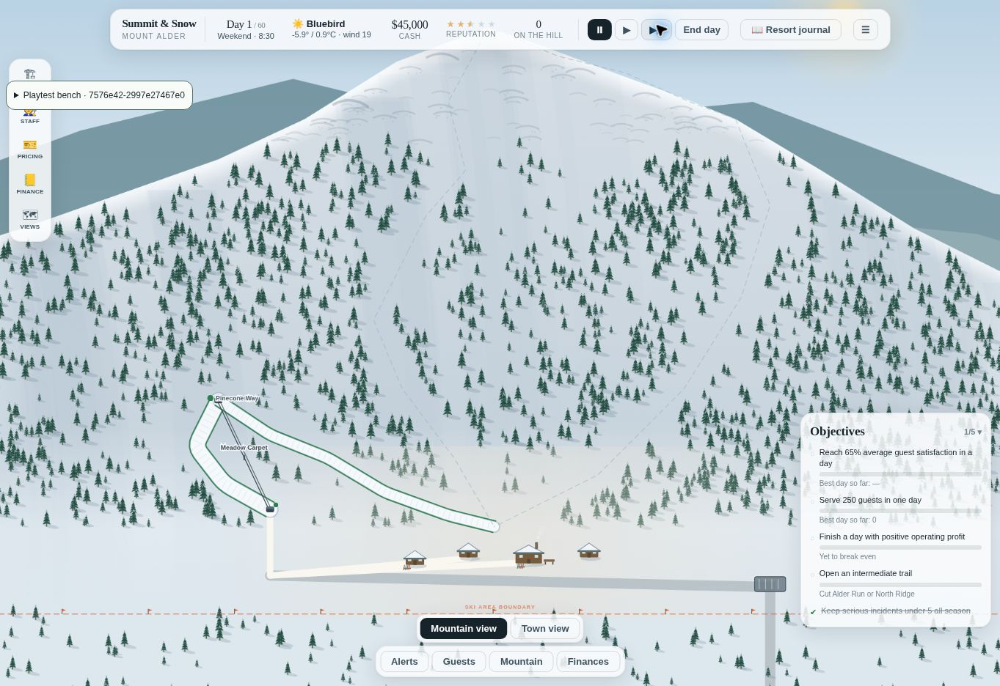
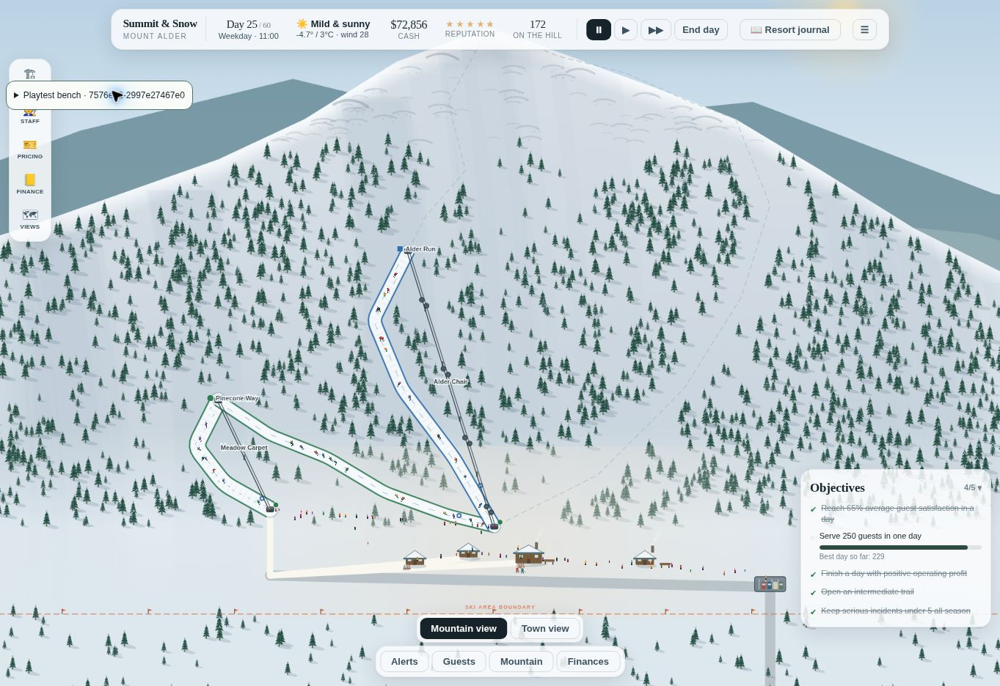
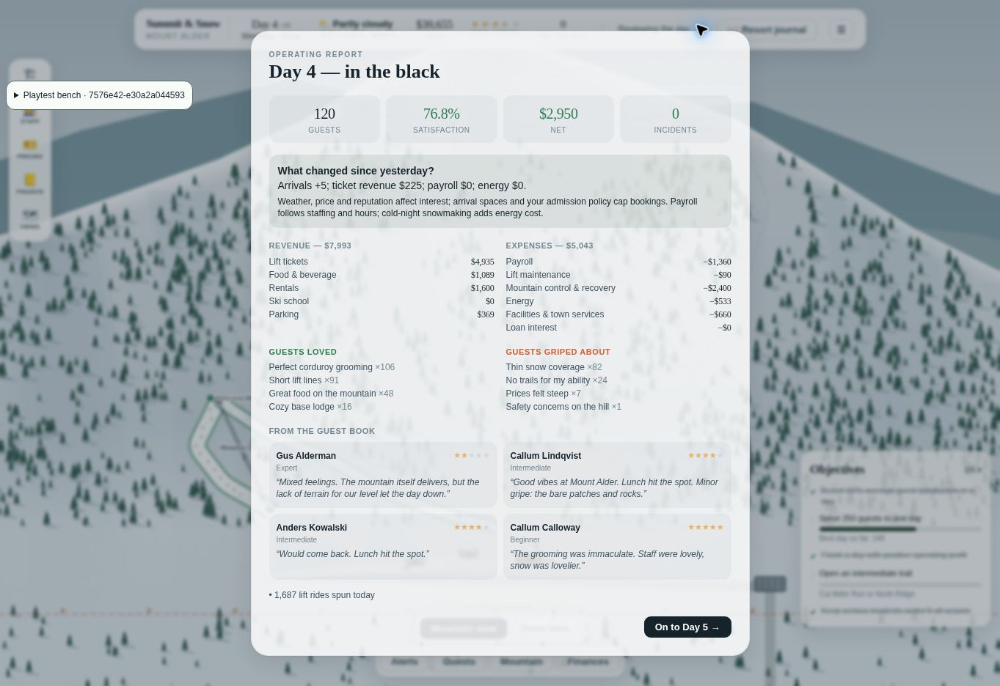
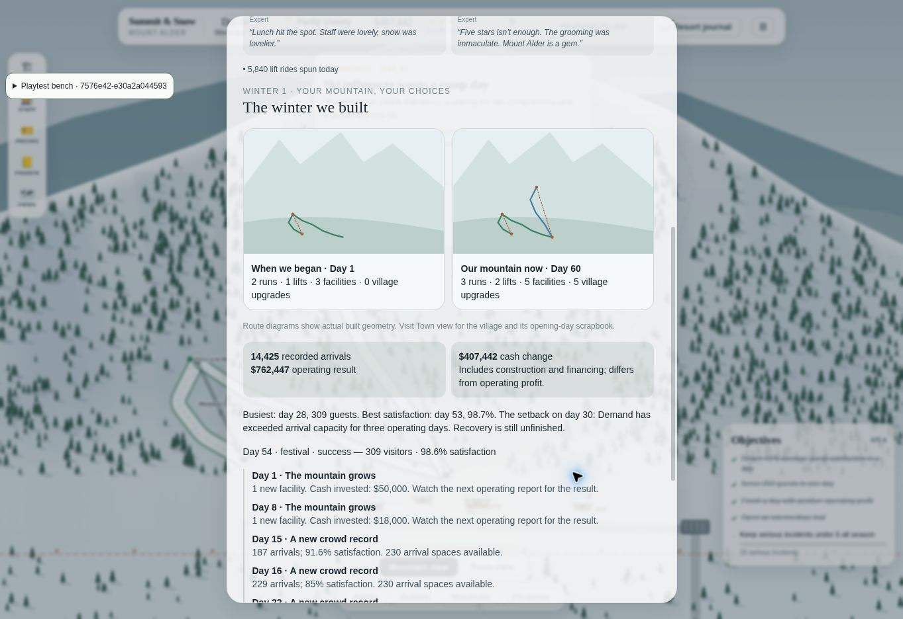

# Browser review — September 16, 2026

Historical first pass. See [completion review](winter-completion.md) for the subsequent fixes and completed checks.

## Builds and evidence

Final review URL (temporary, not production): https://summit-winter-v4.cedar-mist.workers.dev/scripts/winter-review/

Final build: `7576e42-558616fe7e39`; local base commit plus SHA-256 source fingerprint. The branch includes the tested working-tree changes; the GitHub API publication commit has a different ID. Cloudflare version `32d4543f-1ece-4544-b8b3-5f2ac70ba0c9`. Preview only contains compiled public source and newly generated seed-91 fixtures, not preexisting player saves. The temporary hosting account expires unless claimed; the source and reproduction commands remain in the PR.

Most interaction checks below used `7576e42-e30a2a044593`. The final build changes only the access-recovery advice to explicitly require sufficient transport capacity, then received a boot/busy-scene smoke check. Opening and first busy-scene evidence used `7576e42-2997e27467e0`, before the parking rebalance. Reproduce fresh scenes with `npm run playtest:showcase` and `npm run build:review`.

## Observed interactions

- Opening: bought rentals plus teaching through the journal; $80,000 became $45,000, starter lift opened. Ran at normal 1× for approximately the first 54 simulated minutes, then used End day. 132 arrivals, 76.8% satisfaction, $8,953 profit in that build. This was an opening sample, not a seven-hour normal-speed full-season playthrough.
- Thin-snow fixture: paid $2,400 to move Bunny Hollow from 4 to 20 cm, used the new Reopen button, paid the existing $1,800 inspection event, then operated. 120 guests, 76.8% satisfaction, $2,950 operating profit. Recovery expense appeared exactly once. Thin-cover complaints remained: this is a bridge, not free perfect snow.
- Save/load: saved morning day 5, exited to menu and continued; day 5, $39,655 and 3.46 reputation returned.
- Trail controls: placed two custom waypoints; UI showed 335 m, $4,120 and explicit inaccessible/dead-end warnings. Undo returned to one waypoint and disabled construction; Cancel left cash unchanged. No inaccessible trail was purchased. General touch gestures and every facility placement were not covered.
- Busy resort: watched a day-25 scene operate, paused at 205 guests, inspected the town and mountain. UI remained interactive. This is qualitative observation, not an FPS benchmark.
- Closing festival: day-54 fixture had a booked festival. Operated through the actual UI; 309 guests, 98.6% satisfaction, $15,031 operating profit. Event report recorded the actual achieved goal and +0.1 reputation.
- Ending: day-60 fixture rendered a finished season with 14,425 arrivals, $762,447 operating result, $407,442 cash growth, 2→3 runs, 1→2 lifts, 3→5 facilities and 0→5 town upgrades. The recap honestly said the access shortage remained unresolved and recorded the successful festival. Back-to-menu was available; simulation cannot advance past final weather.
- Console inspection showed browser-extension metadata errors; those are not game exceptions. No application exception was observed in the inspected output.
- Feedback freeze/export was exercised, but the cloud browser download event timed out and reset the browser-control session. Exact exported-file restore has **not** been browser-certified. The normal save/load path was verified separately.

## Automated checks

- 177 unit/integration tests across 23 files passed after the recovery controls and parking rebalance.
- Nine independent 60-day strategy simulations passed, 540 operating days with finite balances and arrival-capacity assertions; JSON state roundtrip on day 20. Separate deterministic replay and version-migration tests are in the ordinary suite.
- Production TypeScript/Vite build and worker typecheck passed; nine admin tests passed. Optional review build passed.
- Lint: two existing Fast Refresh warnings (shared.tsx and TopBar.tsx). Vite retains its existing large-chunk warning.

## Iteration and unresolved experience risks

The first policy comparison unfairly left learner/terrain resorts at their initial parking capacity; the second let them respond to three days of unmet demand. The third raised parking from $10,000/$40 daily to $45,000/$240 daily and let the village policy build a second shuttle and a homes compact. Final results are in [winter-balance.md](winter-balance.md).

All strategies survive, but terrain still wins cash ($1.12–1.18m versus learners $0.87–0.94m and village $0.48–0.51m). Race events fail in two seeds while learner/festival events succeed in all three. The village strategy recovers access in one seed and leaves it unresolved in two. These policies are not optimized. Late-season satisfaction and profit remain too generous; this is a playable review candidate, not a claim that the exceptional-season experience goal is fully met.

Physical touch devices, mobile layout at device sizes, quantified busy-resort frame times, a video recording, and feedback file reimport were not verified. Browser tooling exposed no recording or viewport-emulation controls. No production deployment or merge occurred.

## Screenshots

